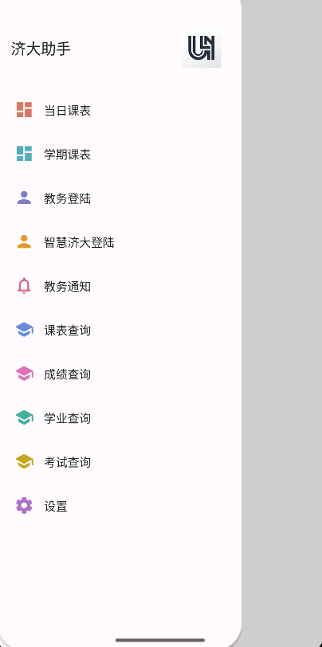
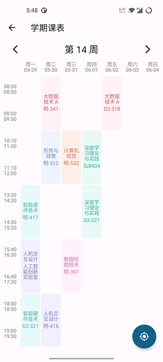
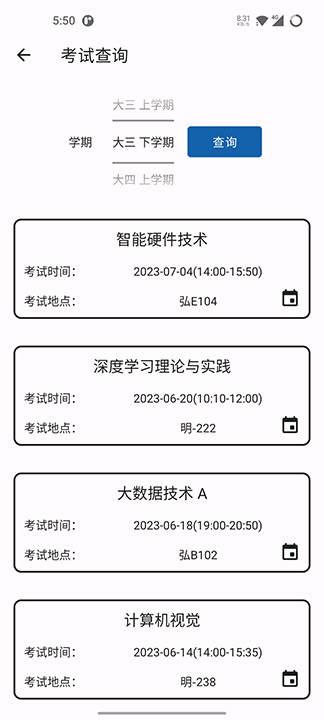

  </a>

# 济大助手

✨ 济南大学-教务系统APP ✨

  
  

### 特别致谢
本软件由2891954521开发，在取得授权的情况下对情况下进行魔改
原软件地址：https://github.com/2891954521/QUST-Assistant
嗯，因为我太菜了，改后有bug，哈哈

### 功能简介 📃

- 丢弃繁重的教务系统,实现APP登录查询

  

### 功能实现 💻

- [ ] 考试信息添加到课表
- [ ] 不同课程标志
- [ ] 多课表支持
- [ ] 课表上课提醒
- [ ] 自动查询课表
- [ ] 自动评教添加批量教评
- [ ] 桌面小部件新增周课表，饮水码
- [x] 考试信息同步到日历
- [x] 教务通知推送
- [x] 成绩推送
- [x] 课表锁定
- [x] 暗色模式开关
- [x] 设置新增隐藏教师功能

### 更新日志 🔖

#### V2.4.3

1. 修复编辑课程保存时教师名称与地点相同的bug
2. 修复电费充值软件崩溃的bug
3. 支持显示上课时间冲突的课程
4. 移除了第三方条形码生成库
